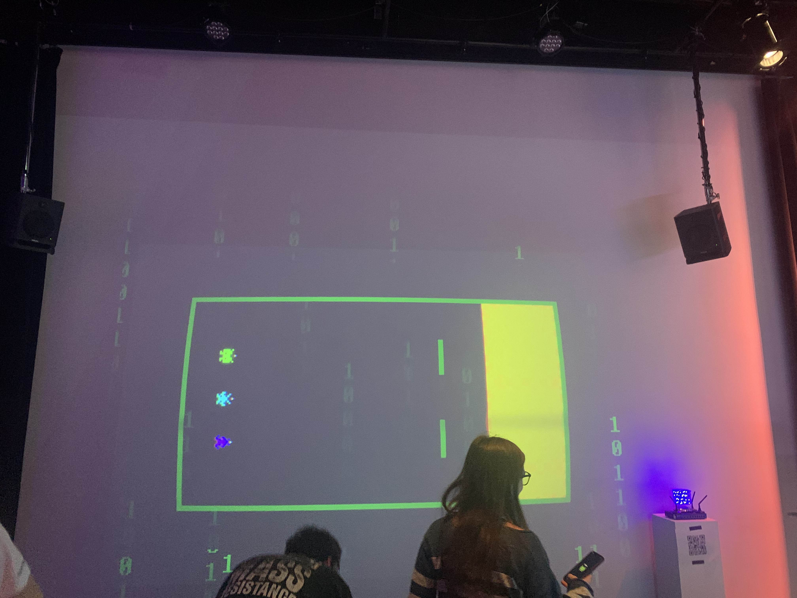
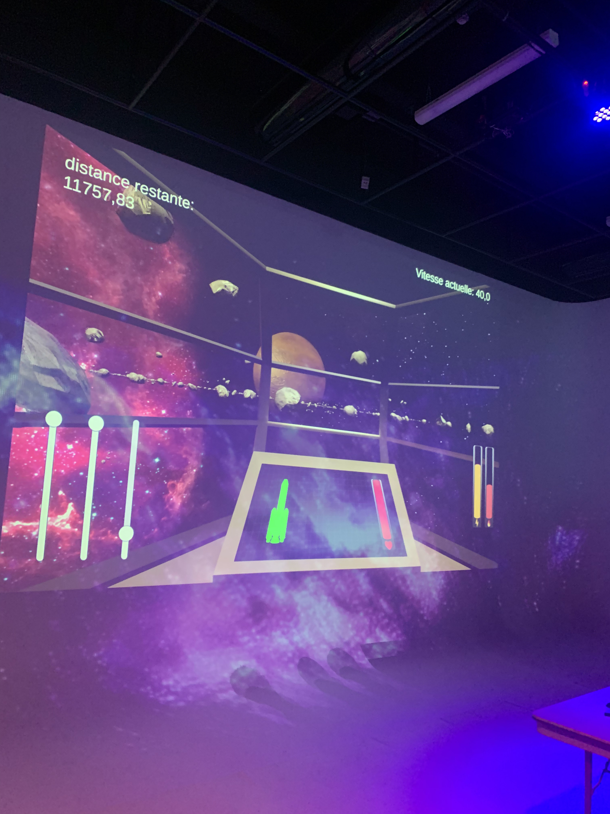
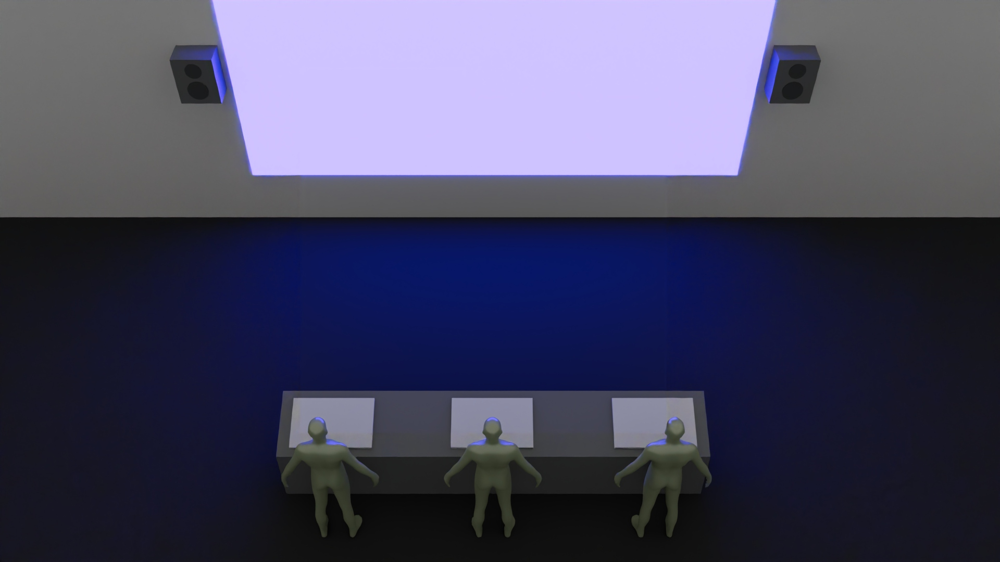
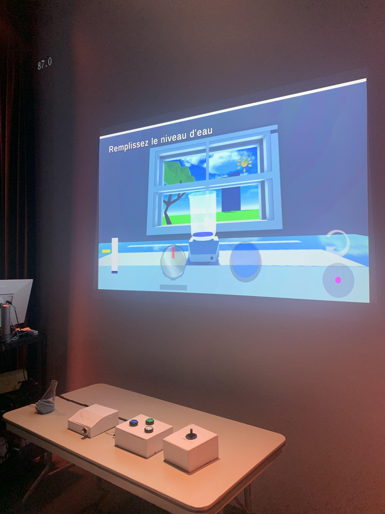
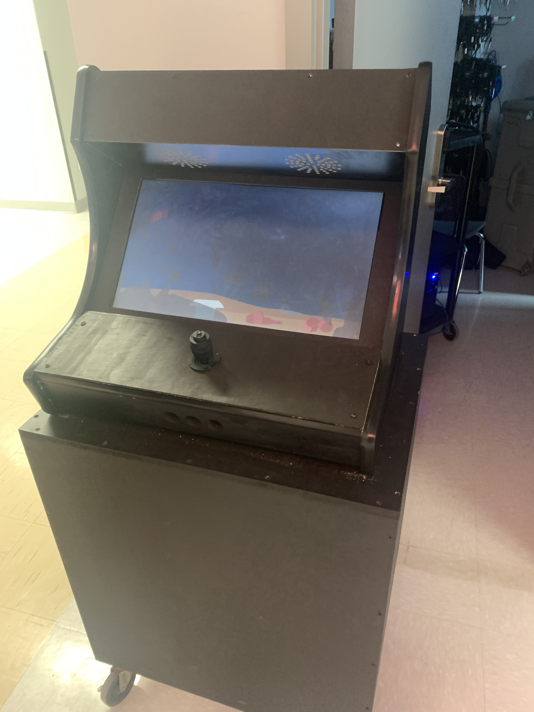
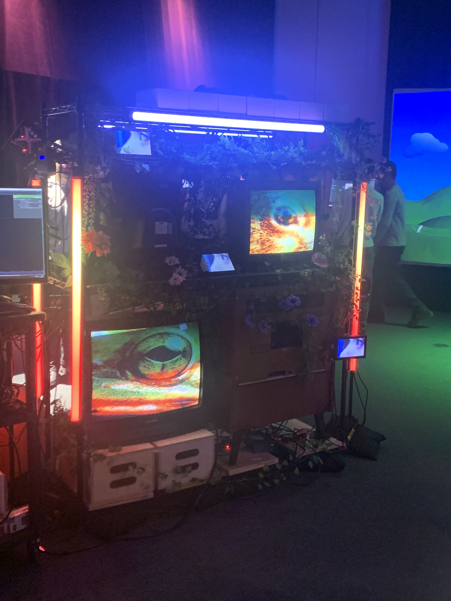
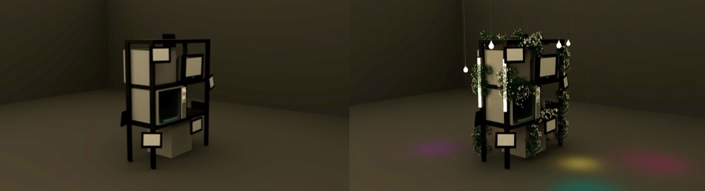
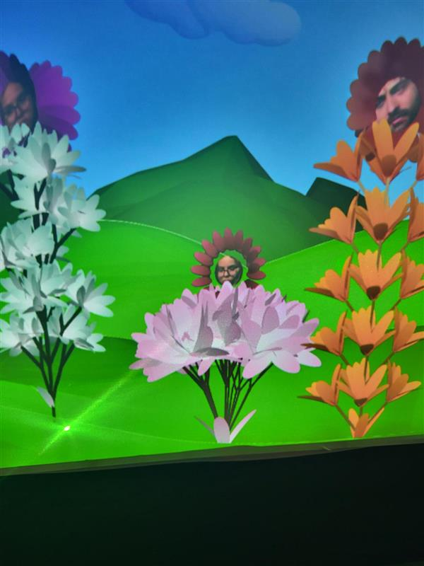

# Les projets des finissants placés par ordre de préférence
## 1- TERMINAL
### Noms des créateurs
- Émeryk Bélisle
- Elie Daher
- Ting Yung Lu Terry
- Dana Saavedre-Torrano
- Mégane Ranger

> Photo prise par David Mirza

> https://pythons-5.github.io/Terminal/#/technique/

Parmis tout les projets des finissants, TERMINAL est le projet que j'ai aimé le plus. Le jeu est ni trop difficile à comprendre et ni trop facile. Pendant que je m'assoie sur un des poufs, je peux jouer au jeu en toute confort et pour une longue durée. J'aime qu'on peut jouer avec plusieurs
personnes et qu'on peut collaborer pour battre des niveaux. Le jeu TERMINAL est pour moi un jeu que je pourrais jouer encore et encore. 
## 2- Mission Décollage (O.I.G.N.O.N)
### Noms des créateurs
- Ahmed Kaissoumi
- Radhouane Kordan
- Justin Montpetit
- Thearylou Lach
- Jad Saloumi

> Photo prise par David Mirza

> https://o-i-g-n-o-n.github.io/Mission-decollage/#/technique/

Pour une personne comme moi qui est intéressé à l'astrologie, le jeu m'a parru intriguant même avant de l'essayer. Après d'avoir essayer le jeu, je peux dire que c'étais compliqué. Il y avait beaucoup de boutons qui fesait différentes choses et j'oubliais tout le temps quel boutons fait quoi.
De plus, il y avait toujours des évènements dans le jeu qui t'empêchait de gagner et ça rendait le jeu trop difficile. Malgré tout ça, j'ai quand même aimé ce projet et la thématique. J'ai aussi aimé qu'on pouvait jouer en collaborant avec d'autres personnes.
## 3- Symbiose
### Noms des créateurs
- Yannick Chamberland
- Benjamin Ferland
- Ryan Dufault
- Walid Cheour

> Photo prise par David Mirza

> https://les-chimistes.github.io/symbiose/#/technique/
## 4- Océan Rouge
### Noms des créateurs
- Amira Tounekti
- Kristy Moussally

> Photo prise par David Mirza

> https://deux-intelligence.github.io/deux-neurones/#/technique/

> https://deux-intelligence.github.io/deux-neurones/#/technique/

## 5- Quand les yeux se croisent
### Noms des créateurs
- Edelwyn Ledu
- Félix Lavoie
- Jade Hébert
- Manel Yaya
- Patricia Nassif

> Photo prise par David Mirza

> https://emersiaa.github.io/Quand-les-yeux-se-croisent/#/technique/

## 6- Arbre en face
### Noms des créateurs
- Alexandre Gendron
- Mikael Arseneau
- Mathieu Willett
- Matis Ghariani
- Rafael Angon Dube

> Photo prise Par Marcus Andrew Bastien

> https://mammouths.github.io/projet/#/technique/ 
