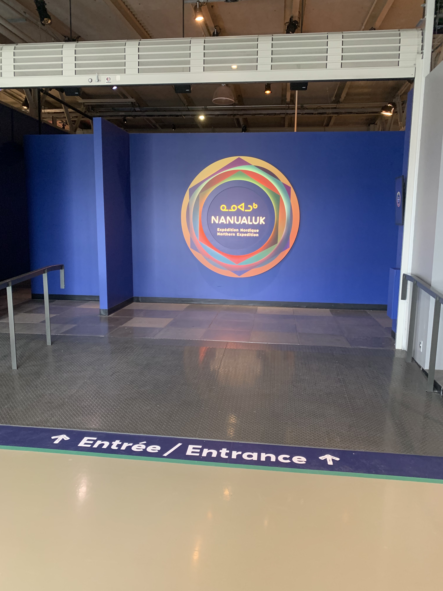
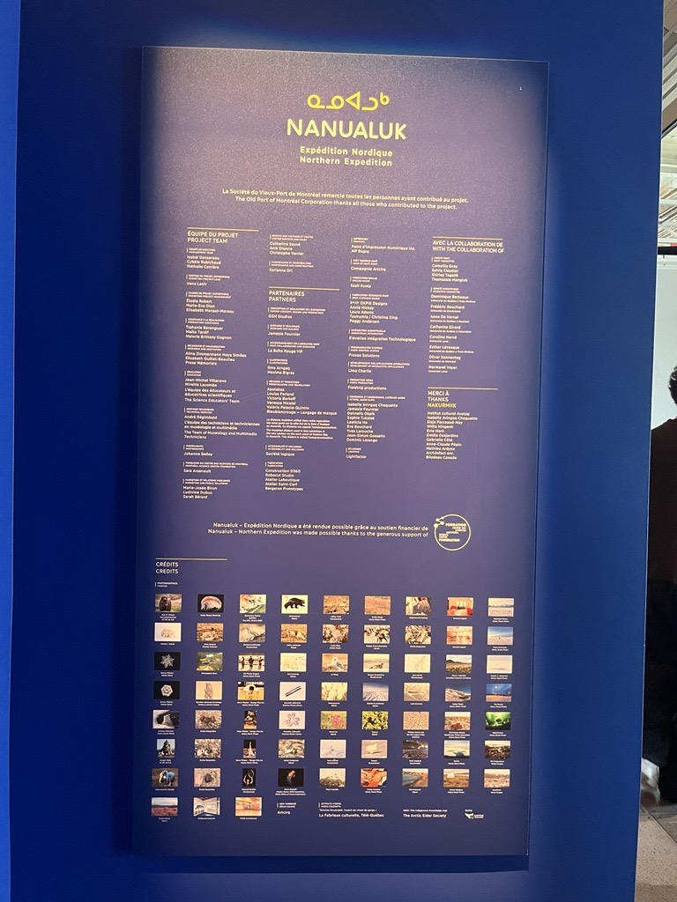
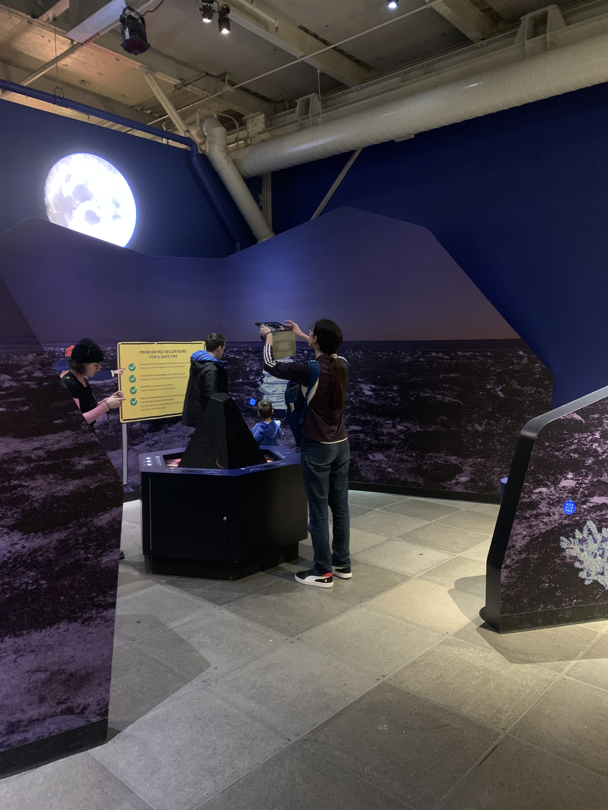
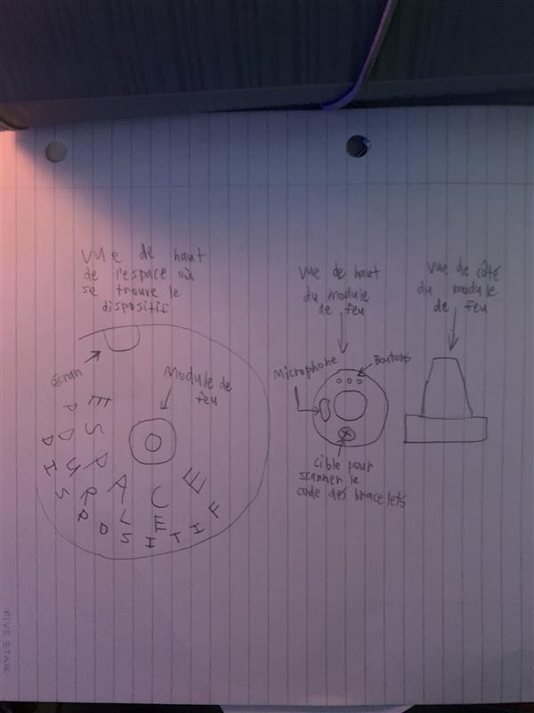
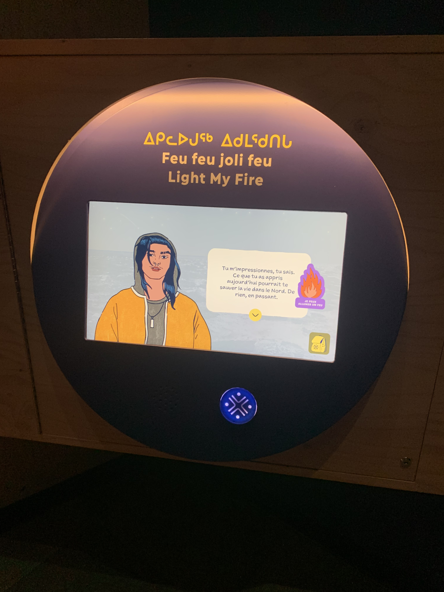
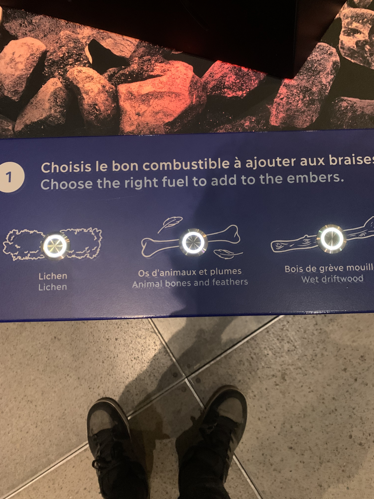
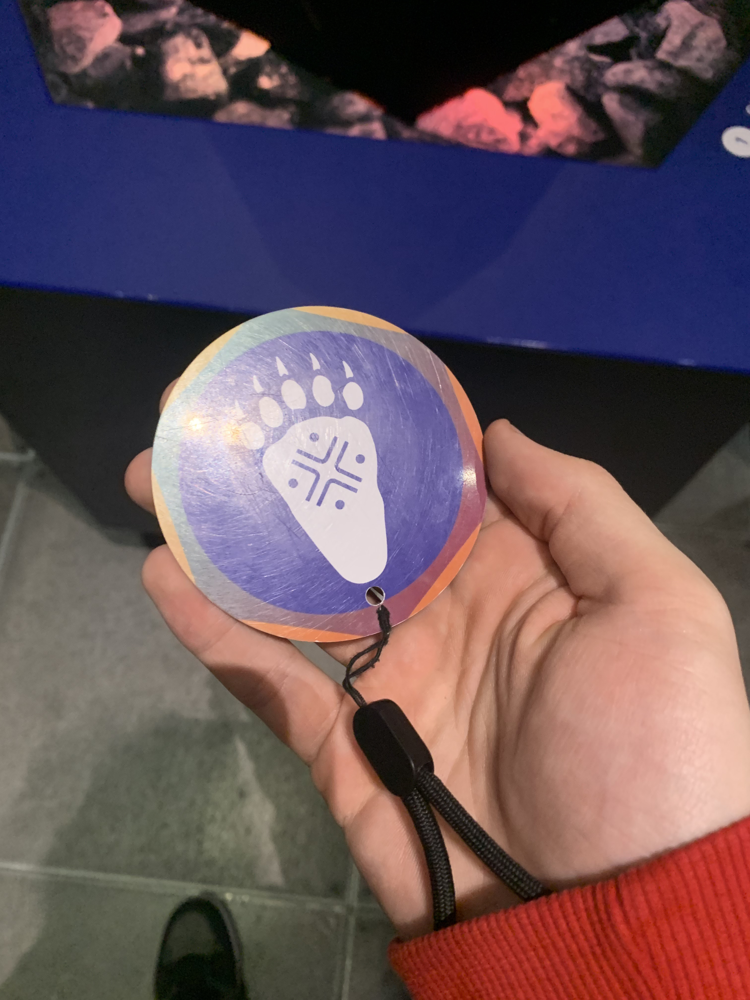
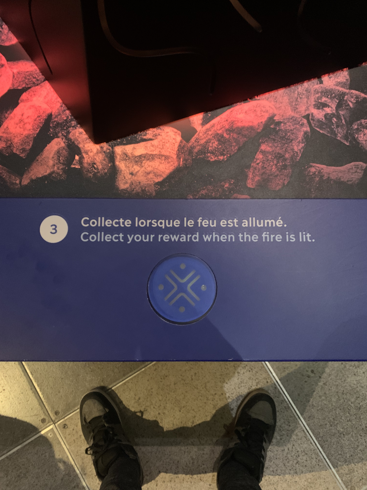
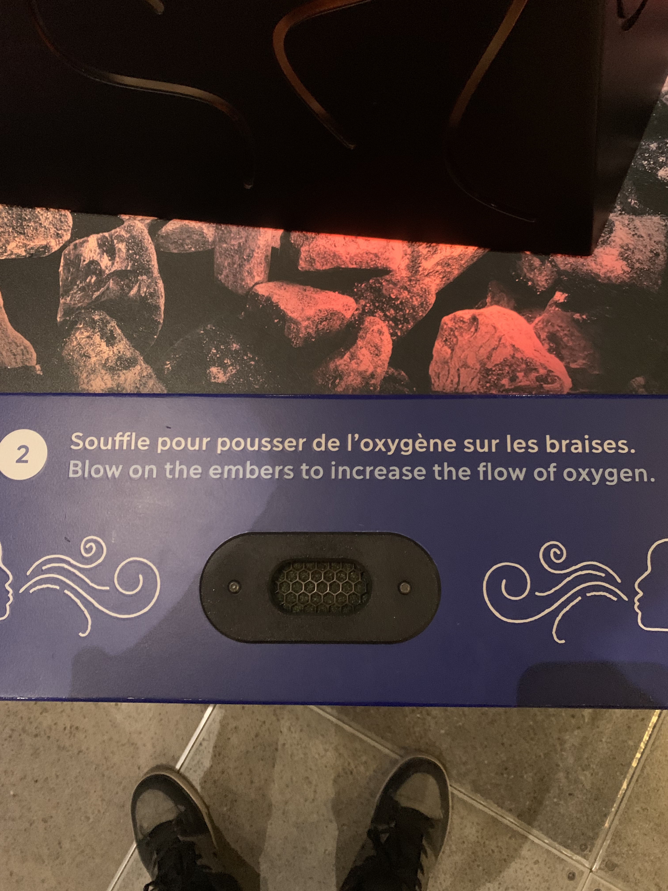
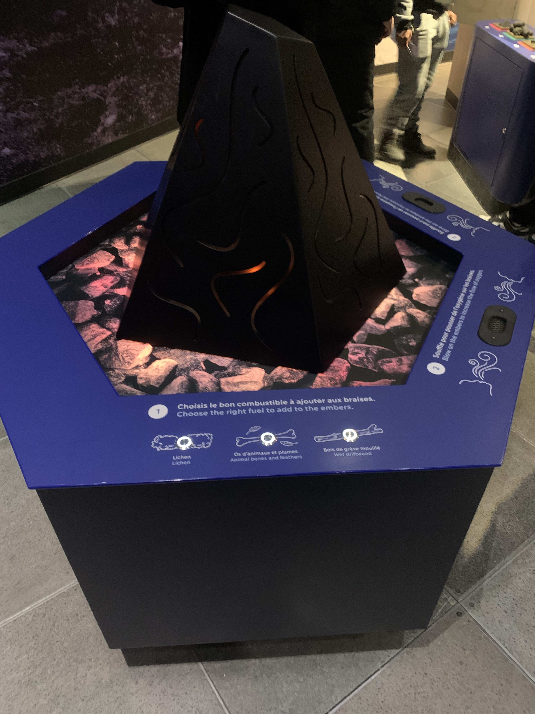

# Nom de l'exposition
Nanualuk - Expédition Nordique

> Photo prise par David Mirza

> Photo prise par Sylvie Francois

## Lieu de l'exposition
Centre des sciences de Montréal
## Date da la visite
Mercredi 1 avril 2026
## Nom du dispositif
Feu feu joli feu

> Photo prise par David Mirza

## Nom de la firme
Gsm Studio
## Partenariat
Centre des sciences de Montréal
## Année de réalisation
L'exposition est randu publique depuis le 1 mars 2025
## Description de l'oeuvre
Le dispositif est composé d'un écran, des boutons, des microphones et des cibles pour scanner le code sur les bracelets. Tout ces composantes se trouve dans un petit espace dans la sale d'exposition où se trouve le dispositif.
## Type d'installation
Permanante
## Fonction du dispositif
Support pédagogique 
## Mise en espace

> Photo prise pas David Mirza

## Composantes et techniques
- Un écran

> Photo prise par David Mirza

- Des boutons

> Photo prise par David Mirza

- Un bracelet avec un code dessus

> Photo prise par David Mirza

- Des cibles où on peut scanner le code sur les bracelets

> Photo prise par David Mirza

- Des microphones

>Photo prise par David Mirza

## Éléments nécessaires à la mise en exposition
- Des murs
## Expérience vécu
Pendant que je testais tout les dispositifs, je voyais au loin de la lumière orange. J'étais intrigué, donc j'ai décidé de voir qu'est-ce qui se passe. Après d'avoir scanné le code du bracelet sur l'écran, j'ai intéragi avec le dispositif. Je devais sélectionner un combustible en appuyant sur les boutons et ensuite soufler sur des microphones. Quand le dispositif salumait, j'étais surpris. C'était fascinant à voire. J'ai joué avec le feu, sans joué avec le feu! 

> Photo prise par David Mirza

## Ce qui m'a plu
- Le dispositif montre aux enfants comment allumer un feu de façon sécuritaire (sans jouer avec le feu pour de vrai)
- C'est facile à comprendre, même pour un enfant
- Le dispositif est attirant
## Ce que je n'ai pas aimé
- Le dispositif ne marche pas si on joue trop longtemps avec
