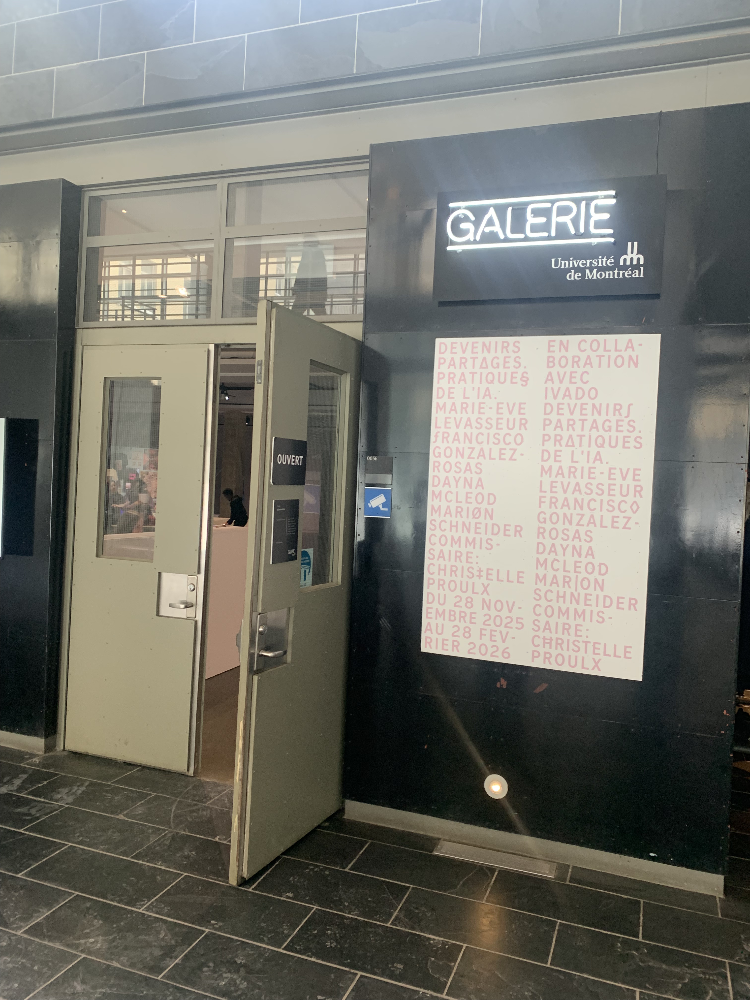
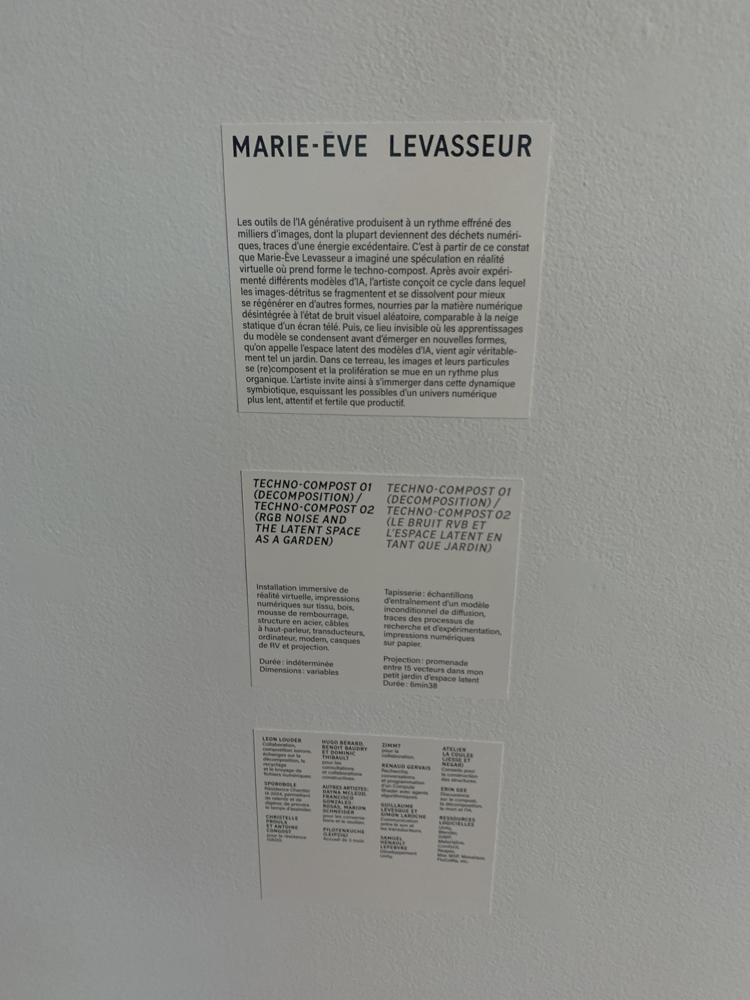
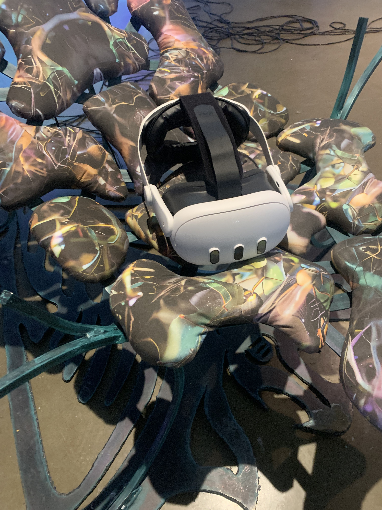
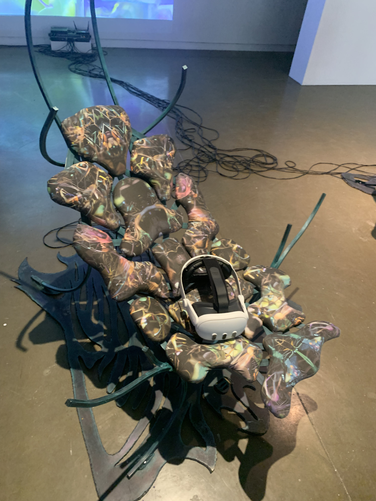
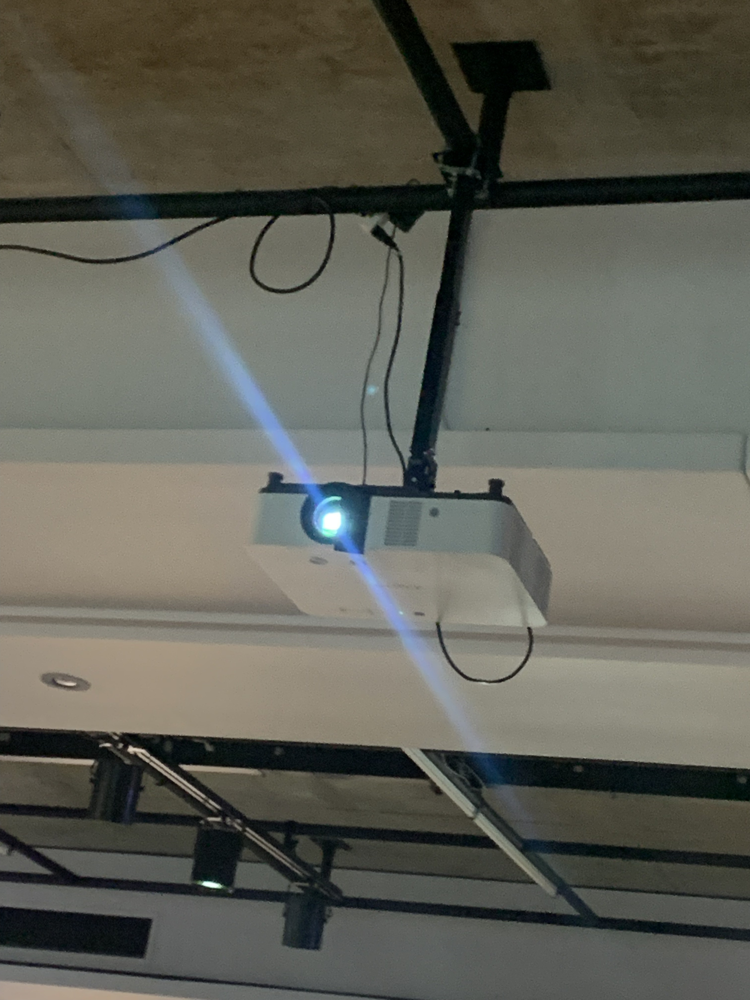
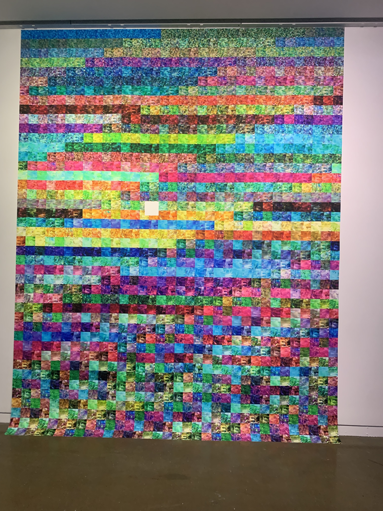
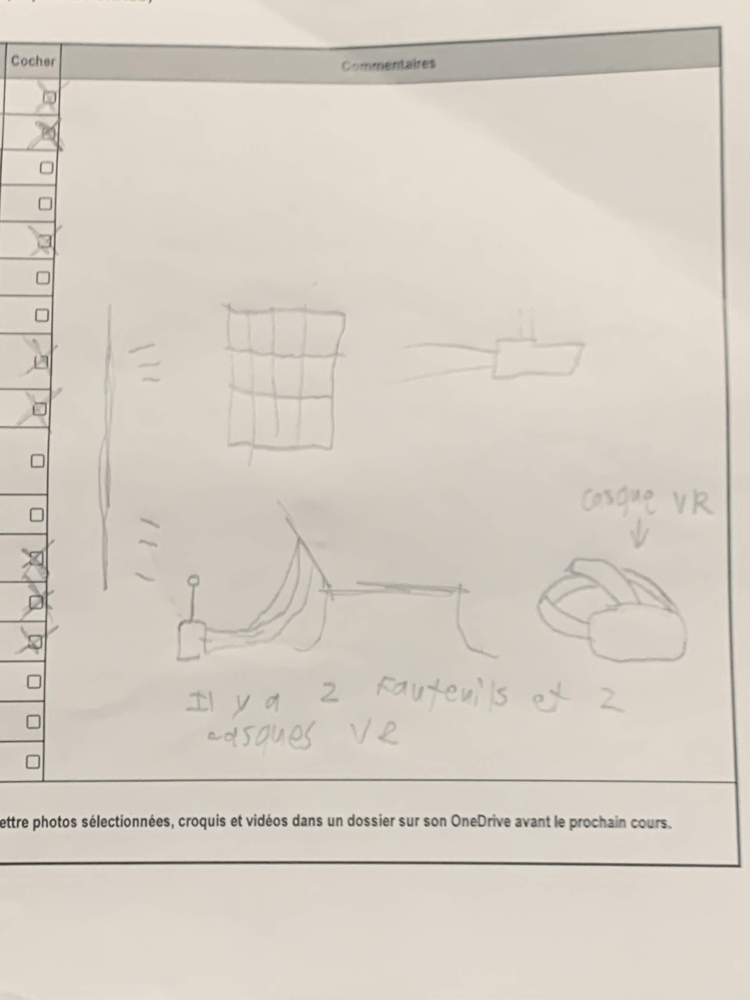

# Devenirs partages. Pratiques de l'IA
## Lieu de l'exposition 
2940, ch. de la Côte-Sainte-Catherine.

> Photo prise par David Mirza

> Photo prise par David Mirza

## Type d'exposition
Temporaire, intérieur
## Date de ma visite
Vendredi 30 janvier, 2026
## Titre de l'oeuvre que j'ai choisi
Techno-compost

> Photo prise par David Mirza

## Nom de l'artiste 
Marie-Ève Levasseur
## Année de réalisation
2025
## Description de l'oeuvre
L'oeuvre de Marie-Ève est séparé en deux parties. La première partie consiste des casques de réalité virtuelle, des chaises faites en bois avec des coussins, un projecteur et des cables. La deuxième partie est une grande affiche remplie d'images générées par l'IA. L'idée derrière l'oeuvre est de "recycler" les images effacées et de les réutiliser. 
## Composantes
L'oeuvre inclus des casque VR, des chaises avec des coussins, un projecteur et des cables et un routeur. Les cables sont attachées derrière les chaises et ils sont connectés vers le routeur et le projecteur. Derrière les chaises, on trouve aussi des haut-parleurs qui vibre les chaises, ce qui emplifie l'effect d'immersion.

Vue d'enssemble de l'oeuvre:

> Photo prise par David Mirza

Les casques VR:

> Photo prise par David Mirza

> Photo prise par David Mirza

Le projecteur:

> Photo prise par David Mirza

Affiche qui illustre des images "recyclées", générées par l'IA (deuxième partie de l'oeuvre):

> Photo prise par David Mirza

## Type d'installation 
Intéractif, immersive
## Mise en espace

> Photo prise par David Mirza

## Éléments de mise en exposition
On a besoins des murs (un mur pour projeter des images venant du casque de réalité virtuelle et un mur pour l'affiche) et un plafon pour accrocher le projecteur.
## Expérience de vécue
Quand j'ai mis le casque VR, je voyais des images d'insectes. J'étais capable de prendre, d'agrandir et de déplacer les images. Pendant ce temps, la chaise vibrait, ce qui emplifiait l'expérience d'immersion.
## Ce que j'ai aimé de l'oeuvre
- J'ai aimé intéragir avec les images dans le casque VR
- La chaise qui vibre emplifie l'expérience d'immersion
## Ce que j'aurai fais autrement
J'aurai aimé qu'il aille plus de casques disponibles aux gens pour essayer, comme ça on ne devrait pas attendre notre tour. Aussi, j'aimerais qu'il aille autre chose à faire avec le casque que de jouer avec des images. Après 5 minutes, ça devient un peu ennuyant.
## Références
- Fiche de banque d'inspiration (donnée par l'enseignante)
- Photos prises avec mon téléphone cellulaire (par David Mirza)
