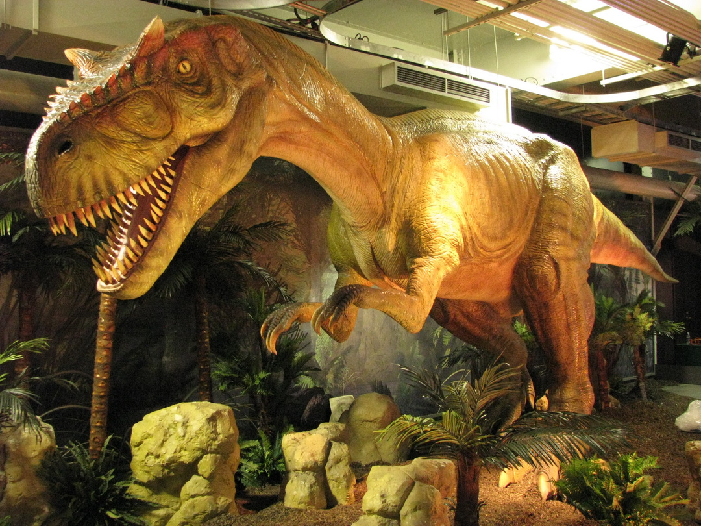

# David Mirza

## **Intérêts dans le multimédia**
J'aime beaucoup programmer et le code m'intéresse beaucoup. Dans le programme TIM, je suis particulièrement intérêssé aux cours de Web et de Programmation intéractive. Ce ne sont pas nécessairement des cours faciles, mais j'aime apprendre des nouvelles balises pour coder. Quand j'étais plus petits, j'ai créé des jeux dans une plateforme nommée Roblox. Mes jeux ont eux peu de succès, mais je trouvais ça quand même amusant. 

## **L'exposition des dinosaures au Centre des sciences de Montréal**

Quand j'étais petit, j'avais une obsession envers les dinosaures. Donc le jour où je suis allé voir l'exposition avec mes parents, j'étais vraiment excité!

Voici une courte vidéo par le Centre des sciences de Montréal qui montre l'exposition: https://www.youtube.com/watch?v=VLV2hyKE-yE 
